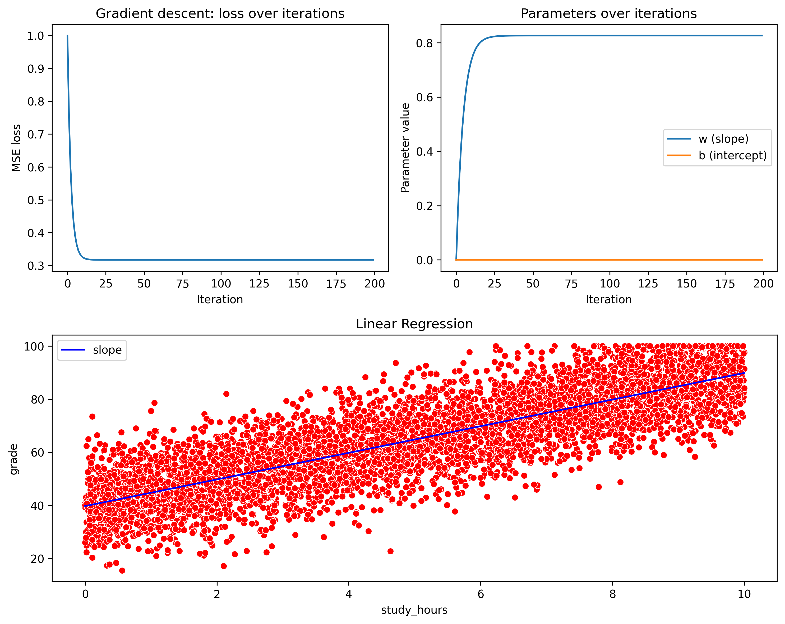

# Time vs Marks — A Linear Regression Study

**Disclaimer:** This project is for educational and research purposes only. The predictions are generated by a mathematical model. The author assumes no responsibility for any decisions made based on this code.

## Introduction

This project explores the relationship between study time and student marks using simple linear regression. Two datasets are used:

- A synthetic study‑hours dataset (used for OUTPUT 1) to demonstrate a clear linear relationship.
- A real‑world students grading dataset (used for OUTPUT 2) to evaluate how well study hours alone predict scores in practice.

For each run, the script prints a sample of the data, model metrics (MSE, RMSE, correlation), and statistical significance of the slope. Figures display the scatterplots with fitted regression lines.

# OUTPUT 1st Half
```text
--- Running Dataset 1 (Synthetic) ---
      study_hours  grade
0            9.15  91.91
1            9.37  86.81
2            2.86  53.39
3            8.30  85.52
4            6.42  77.98
...           ...    ...
4995         4.89  58.91
4996         4.43  65.22
4997         9.91  81.11
4998         6.91  73.79
4999         0.54  55.08

[5000 rows x 2 columns]
Best lr= 0.1
MSE= 98.8873836451361
RMSE= 9.94421357600168
Correlation= 0.8262974416640296
Slope is statistically significant
p-value= 0.0

```



Dataset used for OUTPUT 1 (synthetic example):
- https://www.kaggle.com/datasets/andreylss/study-hours-vs-grades-dataset?resource=download

# OUTPUT 2nd Half
```text
--- Running Dataset 2 (Real Case) ---
      Score  Hours
0     59.61   10.3
1     74.00   27.1
2     63.85   12.4
3     44.44   25.5
4     61.77   13.3
...     ...    ...
4995  45.63    7.8
4996  47.42   24.2
4997  65.83    7.6
4998  57.45   14.5
4999  88.42   29.9

[5000 rows x 2 columns]
Best lr= 0.1
MSE= 292.65287328982896
RMSE= 17.107100084170575
Correlation= 0.004644911549128606
No statistically significant linear relationship
p-value= 0.7426360841829016
```


Dataset used for OUTPUT 2 (real case study):
- https://www.kaggle.com/datasets/mahmoudelhemaly/students-grading-dataset

## Conclusion

This study compared two datasets and the performance of a simple linear regression model predicting marks from study time.

- OUTPUT 1 (synthetic example)
  - The synthetic dataset shows a clear, positive linear relationship between study hours and grades (Correlation ≈ 0.83; RMSE ≈ 9.94).
  - The slope is statistically significant, and the fitted line captures the upward trend in the data.
  - Interpretation: For this generated/example data, the simple linear model is appropriate and performs well.

- OUTPUT 2 (real case study)
  - The real‑world dataset shows no meaningful linear relationship (Correlation ≈ 0.005; RMSE ≈ 17.11) and the slope is not statistically significant (p ≈ 0.743).
  - Interpretation: Study hours alone do not explain the variation in scores in this dataset — other factors, measurement noise, or data issues are likely masking any simple linear effect.

Key takeaways and recommendations
- Do not assume a linear relationship will hold for every dataset. Always run exploratory data analysis and statistical tests before trusting a simple model.
- When a linear model fails (as in OUTPUT 2), consider:
  - Adding relevant predictors (attendance, prior achievement, study quality, socioeconomic factors).
  - Trying non‑linear models or interaction terms.
  - Investigating data quality (outliers, measurement error, sampling bias).
  - Using cross‑validation, regularization, and model comparison metrics to choose an appropriate model.
- Report findings with uncertainty: when p‑values and correlations indicate weak evidence, clearly state that the predictor (study hours) is not sufficient by itself.

Overall, this experiment demonstrates that while linear regression can work well on clean/synthetic data, real‑world outcomes often require deeper modeling and richer data to draw reliable conclusions.
